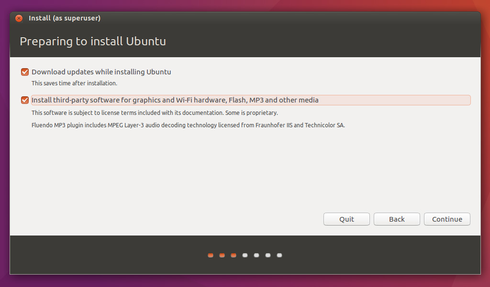
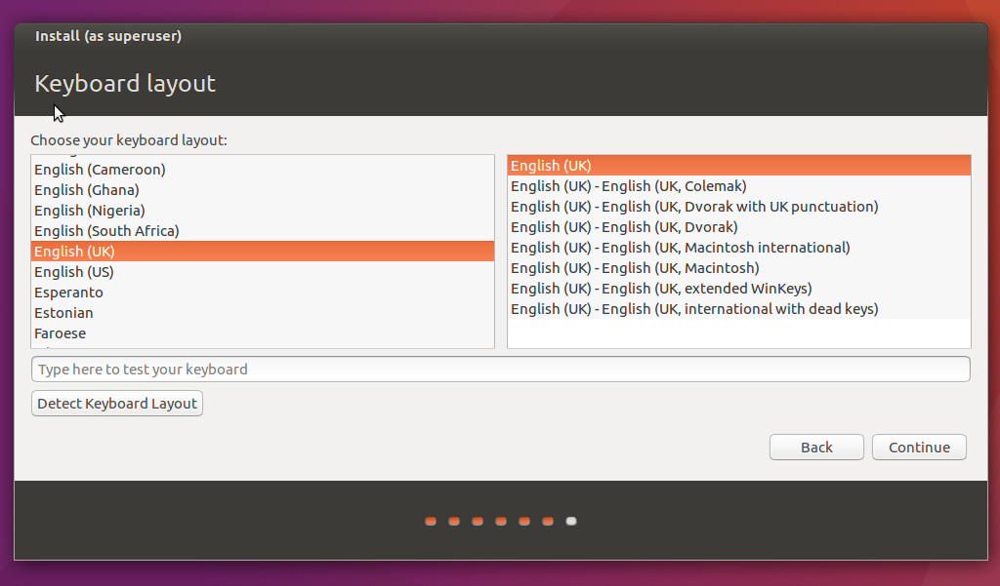
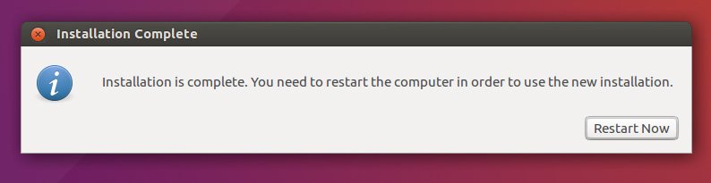

# Switch to Linux from Windows

---

## What is Linux ?
Just like Windows XP, Windows 7, Windows 8, and Mac OS X, Linux is an operating system. An operating system is software that manages all of the hardware resources associated with your desktop or laptop. To put it simply – the operating system manages the communication between your software and your hardware. Without the operating system (often referred to as the “OS”), the software wouldn’t function.

+++

## Why use Linux ?
Linux is a free and open source platform which many operating systems are built upon. If you’re looking to move from Windows to an alternative, here are eight compelling reasons why you should leave Microsoft for a more free and open source operating system.

+++

### 1. Free operating systems for life

All Linux-based operating systems (for the most part) are completely free. You won’t find yourself driving to a Best Buy to buy your copy of Fedora Linux. All that is required is a USB flash drive, an Internet connection and the know-how to get it installed.

+++

### 2. Free programs

More free stuff. Sounds good, right? If you were to install Ubuntu Linux on your laptop, you’d have access to tons of software totally free of charge. You see, Ubuntu operates on the notion that software should be free. Sure, if you look hard enough, you can probably find some programs that cost money, but paid software is largely a minority on the Linux platform.

+++

### 3. Better security

One of Linux’s huge strengths is how seriously security is taken. When you install software it is impossible for you to do so without knowingly entering your password.

Each package go through each and every package and verify that it isn’t malicious and even sign them. This removes the ability for malicious software to install itself (like on Windows).

+++

### 4. It’ll run on anything, including aging hardware

You’d be hard-pressed to find a copy of Microsoft’s latest operating system that can run on something as little as 128 megabytes of RAM. As for Linux, this is totally possible. If you have an aging computer that isn’t compatible with Windows 10, don’t worry! There are Linux projects out there that specifically focus on old hardware.

+++

### 5. No walled gardens

When you use a Linux distribution as your main operating system, you’re not expected to have a Microsoft account, a copy of Office 365, Xbox Live, a Skype account and a One Drive account. You’re not forced to participate in an ecosystem that you may not agree with, and Linux isn’t filled to the brim with one company’s “vision.”  Instead, you get to choose your own. Who can argue with that?

+++

### 6. Your privacy is taken seriously

In Windows 10 your privacy is mostly disregarded. A lot of aspects to Windows 10 are less than privacy-friendly. When you use Microsoft’s new operating system, you are telling them that it is okay for them to collect data on you. They harvest information on your device’s location, your calendar data, emails and texts, contact info, and the list goes on.

+++

### 7. Open source

Most, if not all, Linux distributions are made in part by open source technologies. A vanilla installation of your favorite Linux-based operating system likely won’t contain any closed-code programs. This makes it easier to give away the operating system for free, but it also means that modification of the operating system is legally allowed. This means that if you want, you can freely modify your operating system until your heart is content.

+++

### 8. Customization

Have you ever wanted to change the icons or the way the folders look in Windows? What about the overall way the task bar looks? Maybe you just want to try out a new desktop entirely. On Microsoft’s operating system, this isn’t entirely possible. You’re stuck with the Windows 10 look, and there’s just no getting around that.

+++

#### And most importantly every nerd and geek (also Hacker) out there uses Linux.

---

## How Linux is Built ?

<iframe width="854" height="480" src="https://www.youtube.com/embed/yVpbFMhOAwE" frameborder="0" allowfullscreen></iframe>

---

## Why not to switch from Windows to Linux ?

Linux takes time and enthusiasm to get friend with. Commands, Commands and Commands is all that is going to be your best friend. If you don’t have that, I would suggest you not to switch entirely to Linux. If you want, you may install both.

+++

### 1. Microsoft Office

Productivity on any operating system is without doubt one of the most important things that can make or break a platform however, execution is the key – if done right, enterprise adaptation would be shortly underway.

Although there are tools like LibreOffice, Apache OpenOffice etc but Microsoft Office is the king of office productivity software, so if your work depends heavily on such softwares then linux may not be for you.

+++

### 2. Gaming

Linux is a third-tier gaming platform, with nearly no major studios releasing Linux versions of their games. Mac is second tier, so maybe you don’t care much about games, anyway.

You can still play the heavy games on linux using wine or stem but you will be missing the feel.

+++

### 3. Media Production

Forget ProTools, Garageband, Photoshop, Lightroom, Final Cut. If you do professional class media production, the “open source equivalents” fall short for professionals.

+++

### 4. Flaky driver support for some hardwares

Linux support is always a second tier priority, if any, for hardware providers. The open source community may or may not pick up the ball, and the resulting drivers will vary dramatically in quality. The media drivers are the worst of the bunch, with video drivers being a special circle of hell.

---

#### “Linux is simple and beautiful, but it takes a effort to understand it’s simplicity and beauty.”

So now it is your choice, what you want for your machine's operating system Windows, Linux or maybe something else completely.

For those of brave souls who are considering switching to Linux, here is my guide to make the transition a little less painful.

---

## How To Choose The Best Linux Distro For Your Needs ?

There are hundreds of Linux distributions, for people new to Linux however it is possibly tricky to know which Linux distro is best for them.

[Distrowatch.com](Distrowatch.com) gives a short description of each one as well as a table showing how easy they are to install, who they are for, level of expertise required and the desktop environment that they use.

+++

#### 1. Linux Mint

Linux Mint provides a modern take on what many people have become accustomed to over the years. If you have ever used Windows XP, VIsta or Windows 7 then you will appreciate that there is a panel at the bottom, a menu, a series of quick launch icons and a system tray.

It is easy to install, comes with all the applications you need for general home computing and provides straight forward computing for the masses.

+++

Distro                   	| Linux Mint
--------------------------- | ------------------------------------------
Level Of Expertise Required	| Low
Desktop Environment         | Cinnamon, MATE, XFCE, KDE
Purpose                     | General Desktop Operating System
Download Link               | http://www.linuxmint.com/download.php
Based On                    | Ubuntu, Debian

+++

#### 2. Ubuntu

Ubuntu is a modern desktop operating system designed for the masses and is meant to be every bit as easy to use as Windows or OSX.

With full hardware integration and a complete set of applications most beginners see this as the first step onto the Linux ladder.

If you want to try something other than Windows and you are worried about Linux relying too hard on the command line try Ubuntu because you won't need the terminal window at all.

Easy to install and easy to use with great support.

+++

Distro                  	| Ubuntu
--------------------------- | ------------------------------------------
Level Of Expertise Required	| Low
Desktop Environment         | Unity
Purpose                     | General Desktop Operating System
Download Link               | http://www.ubuntu.com/download/desktop
Based On                    | Debian

+++

#### 3. Fedora (My Favorite)

Fedora is a community distribution based on Red Hat.

Designed to be cutting edge, Fedora always comes with up to date software and drivers and was one of the first distributions to introduce both Wayland and SystemD.

Straight forward to install and comes with a good range of software. Can be temperamental due to the fact that it is so cutting edge and not all packages are stable.

+++

Distro                   	| Fedora
--------------------------- | ------------------------------------------
Level Of Expertise Required	| Low / Medium
Desktop Environment         | GNOME, KDE (+ others)
Purpose                     | To experiments with new concepts
Download Link               | Lightweight yet elegant desktop operating system
Based On                    | Red Hat

+++

#### 4. Elementary

Designed to be lightweight yet easy to install and use with the emphasis on a clean and elegant user interface.

It is based on Ubuntu and so provides access to a large repository of applications.

+++

Distro                     	| Elementary
--------------------------- | ------------------------------------------
Level Of Expertise Required	| Low
Desktop Environment         | Pantheon
Purpose                     | Lightweight yet elegant desktop operating system
Download Link               | https://elementary.io/
Based On                    | Ubuntu

+++

These are some distros from top of my head there are many out there just explore and find the one that fits your need.

---

### I am going to make a guide for Ubuntu Linux a sit is the most popular Linux distros out there and it is beginner friendly and has great community which is helping and quite amazing.

---

## How to Install Ubuntu Linux ?

Ubuntu is one of the most popular forms of the Linux operating system. It is available for free, and will run on almost any computer. This guide will show you how to install Ubuntu by booting from a live USB drive or within Windows itself.

+++

##### Step 1: Create a bootable USB stick on Ubuntu

The first step of installing Ubuntu is to create a live USB or disk. If you are using Windows 7, 8.1 or 10, you can use Universal USB Installer to create a live USB, just follow these steps.

+++

1. Download Ubuntu ISO
    Go to [Ubuntu Download Page](https://www.ubuntu.com/download/desktop) and download the ISO image of your preferred Ubuntu version
2. Download Universal USB Installer
    Once you have downloaded the ISO of Ubuntu, go to [this page](https://www.pendrivelinux.com/universal-usb-installer-easy-as-1-2-3/) and download the latest version of Universal USB Installer.

+++

3. Creating the bootable USB
    Plugin the USB drive in the computer and run Universal USB Installer. You need to do the following things now:

    * Select Ubuntu under step 1
    * Browse to the location of downloaded Ubuntu ISO in Step 2 section
    * In Step 3, select the USB drive and also check the option to format it.

+++


+++

It will present you with obvious warnings, click Yes.


+++

Wait for sometime for the process to complete. You can push it to background, if you like.


+++

That said, live USB should be created in few minutes.


+++

Once the live USB is created, you can proceed with installation of Ubuntu.

+++

##### Step 2: Boot from USB drive?

Most newer computers can boot from USB. You should see a welcome screen prompting you to choose your language and giving you the option to install Ubuntu or try it from the USB.

If your computer doesn’t automatically do so, you might need to press the F12 key to bring up the boot menu, but be careful not to hold it down - that can cause an error message.

+++


+++

##### Step 3: Prepare to install Ubuntu

* It is recommend you plug your computer into a power source
* You should also make sure you have enough space on your computer to install Ubuntu
* We advise you to select Download updates while installing and Install this third-party software now
* You should also stay connected to the internet so you can get the latest updates while you install Ubuntu
* If you are not connected to the internet, you will be asked to select a wireless network, if available, connect during the installation so we can ensure your machine is up to date

+++



+++

##### Step 4: Allocate drive space

Use the checkboxes to choose whether you’d like to Install Ubuntu alongside another operating system, delete your existing operating system and replace it with Ubuntu, or — if you’re an advanced user — choose the ’Something else’ option

+++


+++

##### Step 5: Begin the installation

Depending on your previous selections, you can now verify that you have chosen the way in which you would like to install Ubuntu. The installation process will begin when you click the Install Now button.

+++


+++

##### Step 6: Select your location

If you are connected to the internet, this should be done automatically. Check your location is correct and click ’Forward’ to proceed. If you’re unsure of your time zone, type the name of the town you’re in or click on the map and we’ll help you find it.

+++


+++

##### Step 7: Select your preferred keyboard layout

Click on the language option you need. If you’re not sure, click the ’Detect Keyboard Layout’ button for help.

+++



+++

##### Step 8: Enter your login and password details


+++

##### Step 9: Learn more about Ubuntu while the system installs…

…or make a cup of tea and munch on some snacks!

+++


+++

##### Step 10: That’s it.

All that’s left is to restart your computer and start enjoying Ubuntu!



---

## Things To Do After Installing Ubuntu

A list of essential things to do after installing Ubuntu to get a better experience with it.

Though this list of things to do after installing Ubuntu 16.04 could be different for different users, some of the basic things remain common to everyone.

+++

##### 1. Update the system

First and foremost thing you need to do is to update the system. While it may sound weird because you just installed the OS but trust me on this, you must look for updates.

To update the software fire up the terminal and type following commands

```
$ sudo apt update && sudo apt upgrade
```

+++

##### 2. Install Ubuntu Restricted Extra for media codecs and Flash support

“Ubuntu restricted extras” is the package of several codecs that are not included by default in Ubuntu system. This is due to legal restraints in several countries.

Don’t worry it’s safe to install these codecs. After installing these codecs, you can play different media formats such as MP3, MP4, AVI and several other formats without any trouble. Install it using the following command:

```
$ sudo apt-get install ubuntu-restricted-extras
```

+++

##### 3. Install Some third-party softwares and Indicators

Install some softwares to improve productivity, and again this is my personal choice your need may differ from mine.

* Atom

    I use atom as text editor and I love it, you can download .deb from its [website](https://atom.io/).

+++

* Dropbox

    Download Dropbox Linux client from its official [website](https://www.dropbox.com).

+++

* Gimp

    GIMP is a free and open-source raster graphics editor[6] used for image retouching and editing, free-form drawing, converting between different image formats, and more specialized tasks.

    Install it using following command:

    ```
    $ sudo apt-get install gimp
    ```

+++

* Skype

    Skype is an instant messaging app that provides online text message and video chat services. And pretty necessary thing to have, thus download it from their official [website](https://www.skype.com/en/).

* VLC

    Install VLC to play videos on ubuntu, use following command.

    ```
    $ sudo apt-get install vlc
    ```

+++

##### 4. Improve battery life and reduce overheating with TLP

TLP has become an essential part of each Ubuntu installation for me. This little daemon optimizes the power management in the system and provides you with a longer battery life and reduced overheating.

+++

TLP is now available in the main Ubuntu repository. You can install it using the command

```
$ sudo apt install tlp tlp-rdw
```
Now use the command below to start TLP.

```
$ sudo tlp start
```

---

### I hope this is helpful.
